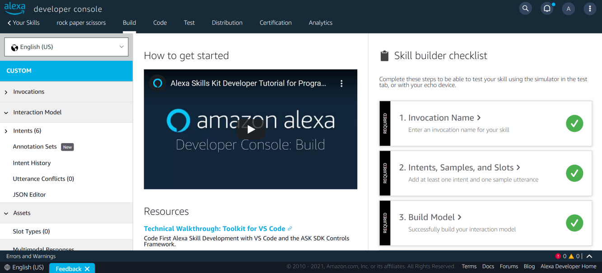

# Alexa Python - Create the skill

[Alexa Python - Create the skill](https://github.com/aissam-out/Alexa-Skills-Python/tree/main/Alexa%20Python%20-%20Create%20the%20skill): Creation of a basic skill that will accompany us throughout our learning journey. I chose a case study that will allow us to add (and therefore learn about) the main functionalities every Alexa skills developer should be aware of.

[Medium post](https://aissam-outchakoucht.medium.com/alexa-skills-with-python-101-tutorial-bf6b7ac71897)

