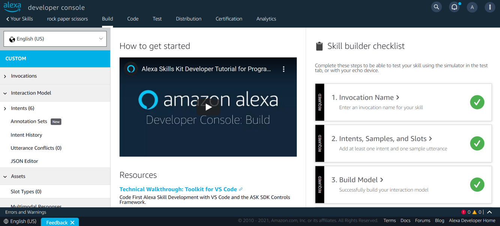
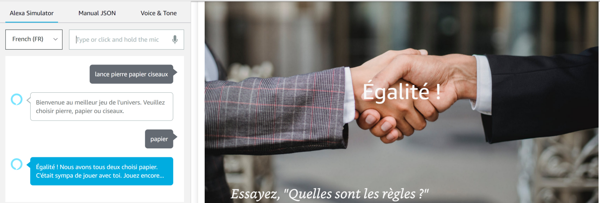
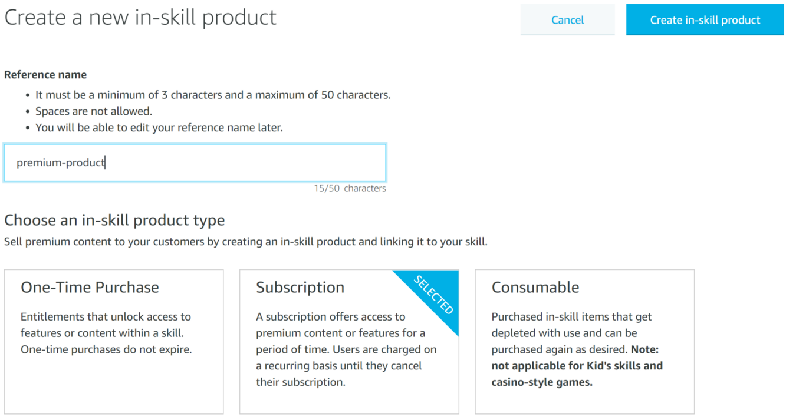

# Alexa-Skills-Python

This project aims to provide you with the main functionalities that you should know if you want to start your journey as an Alexa skills developer. The code in this repo is used to complete a tutorial in Towards Data Science, therefore if you want to have more details about the code check my [Medium profile](https://aissam-outchakoucht.medium.com/).

The vast majority of tutorials and code I found on popular platforms (GitHub, Stack Overflow, Medium, ...) used Node.js, and being a Python guy, I had a hard time finding the right answers to my questions when I encountered a problem. I hope you'll find this series useful if you're trying to develop Alexa skills using Python.

As a case study for this tutorial, I'm developping the popular game Rock Paper Scissors. I chose this game for two reasons: first, because (almost) everyone knows what it is. Second, because of its simplicity. And by simplicity I mean that we won’t worry so much about the logic of the game as we will about learning the Alexa tools.

## [Alexa Python - Create the skill](https://github.com/aissam-out/Alexa-Skills-Python/tree/main/Alexa%20Python%20-%20Create%20the%20skill): 
Creation of a basic skill that will accompany us throughout our learning journey. I chose a case study that will allow us to add (and therefore learn about) the main functionalities every Alexa skills developer should be aware of.

[Medium post](https://aissam-outchakoucht.medium.com/alexa-skills-with-python-101-tutorial-bf6b7ac71897)

 
## [Alexa Python - Alexa Presentation Language](https://github.com/aissam-out/Alexa-Skills-Python/tree/main/Alexa%20Python%20-%20Alexa%20Presentation%20Language): 
This part is about adding Alexa Presentation Language (APL) to our skill. In other words, we will provide a visual experience to Alexa devices that have screens. 

## [Alexa Python - Internationalization (i18n)](https://github.com/aissam-out/Alexa-Skills-Python/tree/main/Alexa%20Python%20-%20i18n): 
Here we will discover how to implement a multi-language skill, that is to have your skill speak different languages depending on where your users are.

## [Alexa Python - Monetization](https://github.com/aissam-out/Alexa-Skills-Python/tree/main/Alexa%20Python%20-%20Monetization): 
This repo covers the monetization techniques, or to put it another way, it is a tutorial on how to earn money through your skill 💰.

